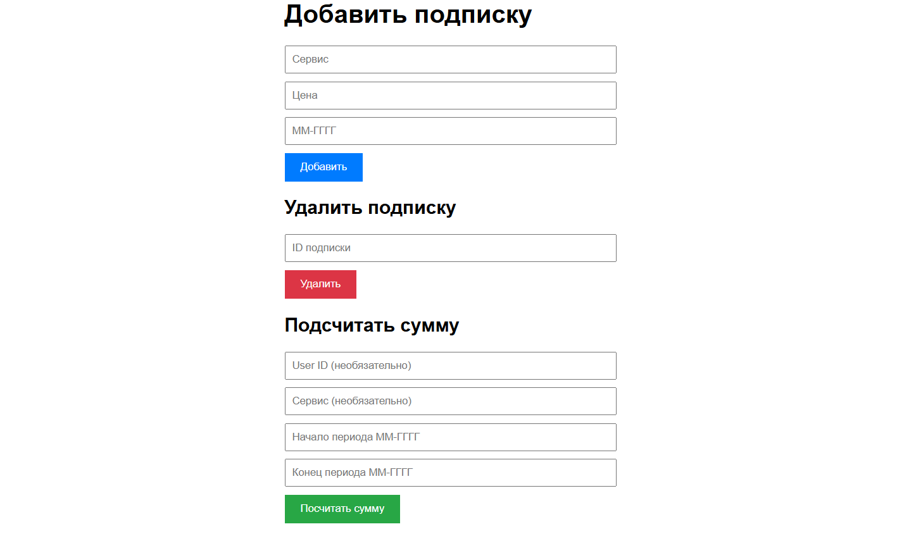

# Subscription-aggregator
REST-сервис для агрегации данных об онлайн-подписках пользователей

## О проекте
Сервис предоставляет API для управления подписками пользователей с возможностью подсчета суммарных расходов за различные периоды.



## Технологии

**Backend:** Go, Gin Framework
**Frontend:** HTML, CSS, JavaScript
**База данных:** PostgreSQL
**Контейнеризация:** Docker, Docker Compose

## Использование 

Ипользуйте следующую команду для копирования репозитория.
```bash
git clone https://github.com/MimPe9/Subscription-aggregator.git
```

Перейдите в нужную директорию.
```bash
cd Subscription-aggregator
```

Запустите Docker контейнер.
```bash
docker-compose up
```

Или же можно воспользоваться командами из файла Makefile.

## API Routes
| Метод   | Route                             | Описание                     |
|---------|-----------------------------------|------------------------------|
| GET     | `/api/subscriptions`              | Получить все подписки        |
| POST    | `/api/subscriptions`              | Создать новую подписку       |
| GET     | `/api/subscriptions/{user_id}`    | Получить подписку по ID      |
| PUT     | `/api/subscriptions/{user_id}`    | Обновить подписку            |
| DELETE  | `/api/subscriptions/del/{user_id}`| Удалить подписку             |
| POST    | `/api/subscriptions/sum`          | Подсчитать сумму подписок    |

## Примеры использования API

Создание подписки:
```bash
curl -X POST http://localhost:8010/api/subscriptions \
  -H "Content-Type: application/json" \
  -d '{
    "service_name": "Netflix",
    "price": 599,
    "start_date": "11-2024"
  }'
```
Подсчёт суммы за период:
```bash
curl -X POST http://localhost:8010/api/subscriptions/sum \
  -H "Content-Type: application/json" \
  -d '{
    "service_name": "Netflix",
    "start_date": "01-2024",
    "end_date": "12-2024"
  }'
```

